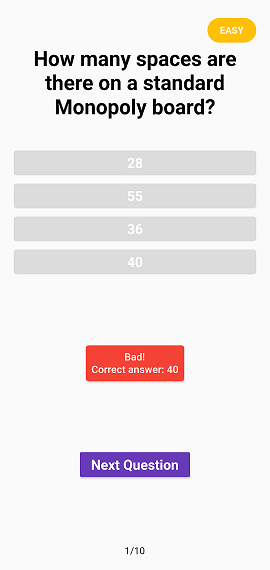
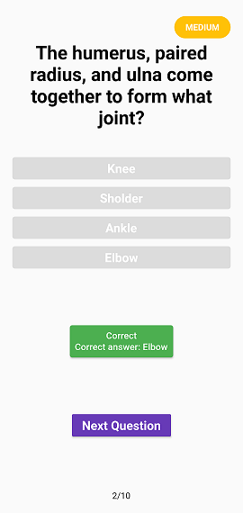
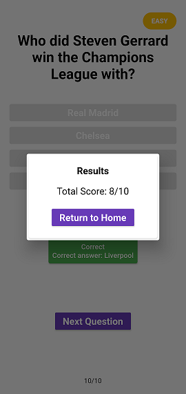

# Quiz App

Simple Quiz App created with OpenTriviaDB






## Init Project

Install dependencies

```
flutter pub get
```

Compile the project

```
flutter build apk
```

## Pub Packages

- [HTTP](https://pub.dev/packages/http)
- [Provider](https://pub.dev/packages/provider)
- [HTML Unescape](https://pub.dev/packages/html_unescape)

## API dependencies

- [OpenTriviaDB](https://opentdb.com/)